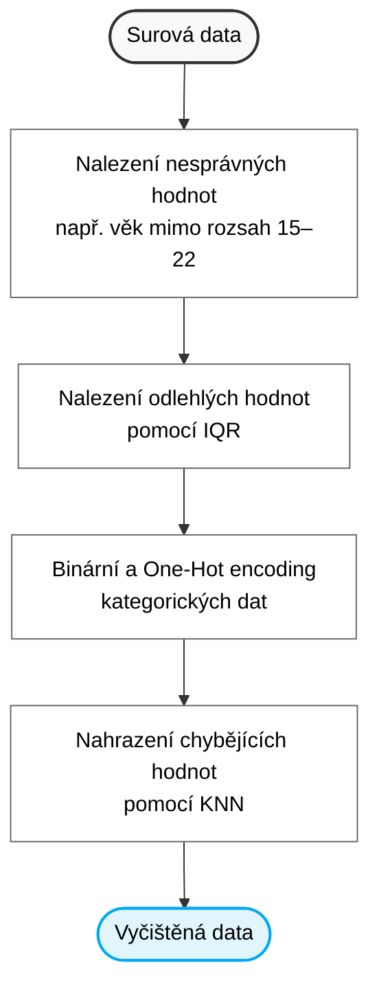

repozitář datasetu: https://archive.ics.uci.edu/dataset/320/student+performance

# ČIŠTĚNÍ DAT

```mermaid
graph TD
    A([Surová data]) --> B[Nalezení nesprávných hodnot<br/>např. věk mimo rozsah 15–22]
    B --> C[Nalezení odlehlých hodnot<br/>pomocí IQR]
    C --> D[Binární a One-Hot encoding<br/>kategorických dat]
    D --> E[Nahrazení chybějících hodnot<br/>pomocí KNN]
    E --> F([Vyčištěná data])
    
    style A fill:#f9f9f9,stroke:#333,stroke-width:2px,color:#000
    style F fill:#e1f5fe,stroke:#03a9f4,stroke-width:2px,color:#000
    style B fill:#fff,stroke:#666,stroke-width:1px,color:#000
    style C fill:#fff,stroke:#666,stroke-width:1px,color:#000
    style D fill:#fff,stroke:#666,stroke-width:1px,color:#000
    style E fill:#fff,stroke:#666,stroke-width:1px,color:#000
```
